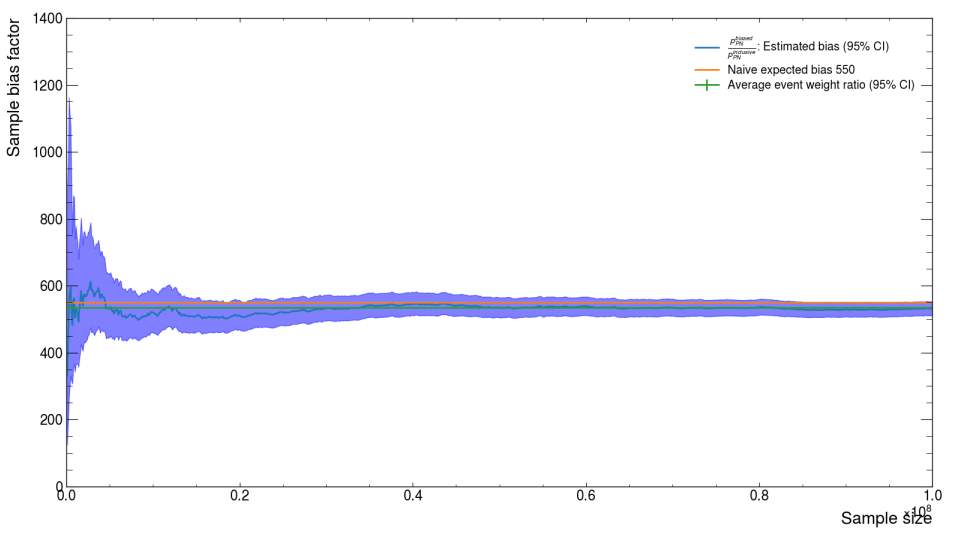
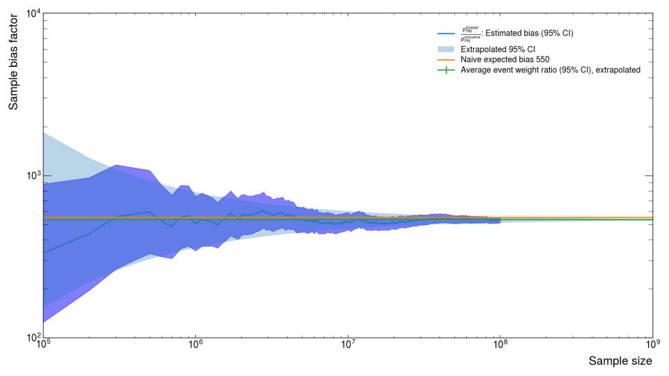
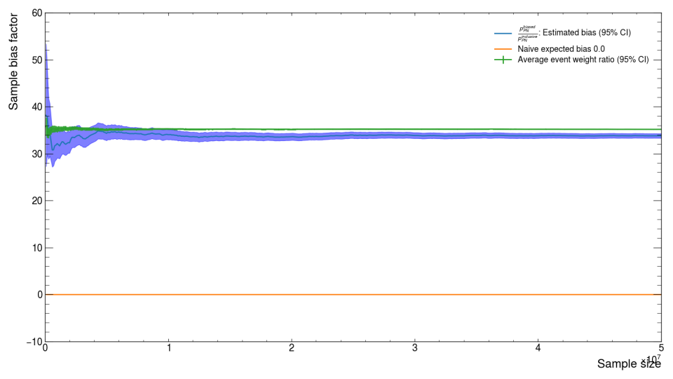

# Electrons on Target
The number of "Electrons on Target" (EoT) of a simulated or collected data sample
is an important measure on the quantity of data the sample represents.
Estimating this number depends on how the sample was constructed.

## Real Data Collection
For real data, the accelerator folks at SLAC construct a beam that has a few parameters we can
measure (or they can measure and then tell us).
- duty cycle \\(d\\): the fraction of time that the beam is delivering bunches
- rate \\(r\\): how quickly bunches are delivered
- multiplicity \\(\mu\\): the Poisson average number of electrons per bunch

The first two parameters can be used to estimate the number of bunches the beam delivered to LDMX
given the amount of time we collected data \\(t\\).
\\[
  N_\text{bunch} = d \times r \times t
\\]

For an analysis that only inspects single-electron events, we can use the Poisson fraction of these
bunches that corresponds to one-electron to estimate the number of EoT the analysis is inspecting.
\\[
  N_\text{EoT} \approx \mu e^{-\mu} N_\text{bunch}
\\]
If we are able to include all bunches (regardless on the number of electrons), then we can replace
the Poisson fraction with the Poisson average.
\\[
  N_\text{EoT} \approx \mu N_\text{bunch}
\\]
A more precise estimate is certainly possible, but has not been investigated or written down
to my knowledge.

## Simulation
For the simulation, we configure the sample generation with a certain number of electrons
per event (usually one) and we decide how many events to run for.
Complexity is introduced when we do more complicated generation procedures in order to
access rarer processes.

~~~admonish warning title="Single Electron Events"
All of the discussion below is for single-electron events.
Multiple-electron events are more complicated and have not been studied in as much detail.
~~~

In general, a good first estimate for the number of EoT a simulation sample represents is
\\[
N_\text{EoT}^\text{equiv} = \frac{N_\text{sampled}}{\sum w} N_\text{attempt}
\\]
where
- \\(N_\text{sampled}\\) is the number of events in the file(s) that constitute the sample
- \\(\sum w\\) is the sum of the event weights of those same events
- \\(N_\text{attempt}\\) is the number of events that were attempted when simulating

~~~admonish note title="Finding Number of Attempted Events"
Currently, the number of attempted events is stored as the `num_tries_` member of
the `RunHeader`

Samples created with ldmx-sw verions newer than v3.3.4 (>= v3.3.5) have an update
to the processing framework to store this information more directly
(in the `numTries_` member of the RunHeader or <= v4.4.7 and the `num_tries_` member
for newer).
Samples created with ldmx-sw versions older than v3.1.12 (<= v3.1.11) have access
to the "Events Began" field of the `intParameters_` member of the RunHeader.

The easiest way to know for certain the number of tries is to just set the maximum
number of events to your desired number of tries \\(N_\mathrm{attempt}\\) and limit the
number of tries per output event to one (`p.maxTriesPerEvent = 1` and `p.maxEvents = Nattempt`
in the config script).
~~~

### Inclusive
The number of EoT of an inclusive sample (a sample that has neither biasing or filtering)
is just the number of events in the file(s) that constitute the sample.

The general equation above still works for this case.
Since there is no biasing, the weights for all of the events are one \\(w=1\\) so the sum
of the weights is equal to the number of events sampled \\(N_\text{sampled}\\).
Since there is no filtering, the number of events attempted \\(N_\text{attempt}\\) is also equal
to the number of events sampled.
\\[
  N_\text{EoT}^\text{inclusive} = N_\text{sampled}
\\]

### Filtered
Often, we filter out "uninteresting" events, but that should not change the EoT the sample
represents since the "uninteresting" events still represent data volume that was processed.
This is the motivation behind using number of events attempted \\(N_\text{attempt}\\) instead
of just using the number in the file(s).
Without any biasing, the weights for all of the events are one so the sum of the weights
is again equal to the number of events sampled and the general equation simplifies to
just the total number of attempts.
\\[
  N_\text{EoT}^\text{filtered} = N_\text{attempt}
\\]

### Biased
Generally, we find the equivalent electrons on target (\\(N_\text{EoT}^\text{equiv}\\))
by multiplying the attempted number of electrons on target (\\(N_\mathrm{attempt}\\))
by the biasing factor (\\(B\\)) increasing the rate of the process focused on for the sample.

In the thin-target regime, this is satisfactory since the process we care about either
happens (with the biasing factor applied) or does not (and is filtered out).
In thicker target scenarios (like the Ecal), we need to account for events where
unbiased processes happen to a particle _before_ the biased process.
Geant4 accounts for this while stepping tracks through volumes with
biasing operators attached and we include the weights of all steps in the overall event
weight in our simulation.
We can then calculate an effective biasing factor by dividing the total number of events
in the output sample (\\(N_\mathrm{sampled}\\)) by the sum of their event weights (\\(\sum w\\)).
In the thin-target regime (where nothing happens to a biased particle besides the
biased process), this equation reduces to the simpler \\(B N_\mathrm{attempt}\\) used in other
analyses since biased tracks in Geant4 begin with a weight of \\(1/B\\).
\\[
N_\text{EoT}^\text{equiv} = \frac{N_\mathrm{sampled}}{\sum w}N_\mathrm{attempt}
\\]

## Event Yield Estimation
Each of the simulated events has a weight that accounts for the biasing that was applied.
This weight quantitatively estimates how many _unbiased_ events this single
_biased_ event represents.
Thus, if we want to estimate the total number of events produced for a desired EoT
(the "event yield"), we would sum the weights and then scale this weight sum by the ratio
between our desired EoT \\(N_\text{EoT}\\) and our actual simulated EoT \\(N_\text{attempt}\\).
\\[
N_\text{yield} = \frac{N_\text{EoT}}{N_\text{attempt}}\sum w
\\]
Notice that \\(N_\text{yield} = N_\text{sampled}\\) if we use
\\(N_\text{EoT} = N_\text{EoT}^\text{equiv}\\) from before.
Of particular importance, the scaling factor out front is constant across all events
for any single simulation sample, so (for example) we can apply it to the contents of a
histogram so that the bin heights represent the event yield within \\(N_\text{EoT}\\) events
rather than just the weight sum (which is equivalent to \\(N_\text{EoT} = N_\text{attempt}\\)).

Generally, its a bad idea to scale too far above the equivalent EoT of the sample, so usually
we keep generating more of a specific simulation sample until \\(N_\text{EoT}^\text{equiv}\\)
is above the desired \\(N_\text{EoT}\\) for the analysis.

## More Detail
This is a copy of work done by Einar Elén for [a software development meeting in Jan 2024](https://indico.fnal.gov/event/63045/).

The number of selected events in a sample \\(M = N_\text{sampled}\\) should be binomially distributed
with two parameters: the number of attempted events \\(N = N_\text{attempt}\\) and probability \\(p\\).
To make an EoT estimate from a biased sample with \\(N\\) events, we need to know
how the probability in the biased sample differs from one in an inclusive sample.

Using "i" to stand for "inclusive" and "b" to stand for "biased".
There are two options that we have used in LDMX.
1. \\(p_\text{b} = B p_\text{i}\\) where \\(B\\) is the biasing factor.
2. \\(p_\text{b} = W p_\text{i}\\) where \\(W\\) is the ratio of the average event weights between the two samples. Since the inclusive sample has all event weights equal to one, \\(W = \sum_\text{b} w / N\\) so it represents the EoT estimate described above.

~~~admonish note title="Binomial Basics"
- Binomials are valid for distributions corresponding to some number of binary yes/no questions.
- When we select \\(M\\) events out of \\(N\\) generated, the probability estimate is just \\(M/N\\).

We want \\(C = p_\text{b} / p_\text{i}\\).

The ratio of two probability parameters is not usually well behaved, but the binomial distribution is special.
A 95% Confidence Interval can be reliably calculated for this ratio:
\\[
  \text{CI}[\ln(C)] = 1.96 \sqrt{\frac{1}{N_i} - \frac{1}{M_i} + \frac{1}{N_b} - \frac{1}{M_b}}
\\]
This is good news since now we can extrapolate a 95% CI up to a large enough sample size using smaller
samples that are easier to generate.
~~~

### Biasing and Filtering
For "normal" samples that use some combination of biasing and/or filtering, \\(W\\) is a good (unbiased)
estimator of \\(C\\) and thus the EoT estimate described above is also good (unbiased).

For example, a very common sample is the so-called "Ecal PN" sample where we bias and filter for a high-energy
photon to be produced in the target and then have a photon-nuclear interaction in the Ecal mimicking our missing
momentum signal.
We can use this sample (along with an inclusive sample of the same size) to directly calculuate \\(C\\) with
\\(M/N\\) and compare that value to our two estimators.
Up to a sample size \\(N\\) of 1e8 (\\(10^8\\) both options for estimating \\(C\\) look okay (first image),
but we can extrapolate out another order of magnitude and observe that only the second option \\(W\\) stays within
the CI (second image).

### Photon-Nuclear Re-sampling
Often we want to not only require there to be a photon-nuclear interaction in the Ecal, but we also want
that photon-nuclear interaction to produce a specific type of interaction (usually specific types of particles
and/or how energetic those particles are) -- known as the "event topology".

In order to support this style of sample generation, ldmx-sw is able to be configured such that when the
PN interaction is happening, it is repeatedly re-sampled until the configured event topology is produced
and then the simulation continues.
The estimate \\(W\\) ends up being a slight over-estimate for samples produced via this more complicated process.
Specifically, a "Kaon" sample where there is not an explicit biasing of the photon-nuclear interaction but
the photon-nuclear interaction is re-sampled until kaons are produced already shows difference between the
"true" value for \\(C\\) and our two short-hand estimates from before (image below).

The overly-simple naive expected bias \\(B\\) is wrong because there is no biasing,
but the average event weight ratio estimate \\(W\\) is also wrong
in this case because the current (ldmx-sw v4.5.2) implementation of the re-sampling procedure updates the event
weights incorrectly.
[Issue #9999](https://github.com/LDMX-Software/ldmx-sw/issues/9999) documents what we believe is incorrect
and a path forward to fixing it.
In the meantime, just remember that if you are using this configuration of the simulation, the estimate for the
EoT explained above will be slighly higher than the "true" EoT.
You can repeat this experiment on a medium sample size (here 5e7 = 50M events) where an inclusive sample can
be produced to calculate \\(C\\) directly.
