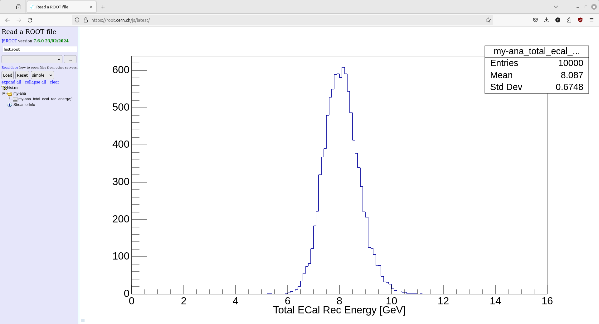

# Using ldmx-sw Directly

As you may be able to pick up based on my tone, I prefer the (efficient) python analysis
method given before using `uproot`, `awkward`, and `hist`. Nevertheless, there are two
main reasons I've had for putting an analysis into the ldmx-sw C++.
1. **Longevity**: While the python ecosystem evolving quickly is helpful for obtaining
  new features, it can also cause long-running projects to "break" -- forcing a refactor
  that is purely due to upstream code changes.[^1] Writing an analysis into C++, with its
  more rigid view on backwards compatibility, essentially solidifies it so that it can
  be run in the same way for a long time into the future.
2. **Non-Vectorization**: In the previous chapter, I made a big deal about how most
  analyses can be vectorizable and written in terms of these pre-compiled and fast
  functions. That being said, sometimes its difficult to figure out _how_ to write
  an analysis in a vectorizable form. Dropping down into the C++ allows analyzers
  to write the `for` loop themselves which may be necessary for an analysis to
  be understandable (or even functional).

[^1]: This longevity issue can be resolved within python by "pinning" package versions
so that all developers of the analysis code use the same version of python and the
necessary packages. Nevertheless, this "pinning" also prevents analyzers from obtaining
new features or bug fixes brought into newer versions of the packages.

The following example is **stand-alone** in the same sense as the prior chapter's
jupyter notebook. It can be run from outside of the ldmx-sw repository; however,
this directly contradicts the first reason for writing an analysis like this
in the first place. I would recommend that you store your analyzer source code
in ldmx-sw or the private ldmx-analysis. These repos also contain CMake infrastructure
so you can more easily share code common amongst many processors.

## Set Up
I am going to use the same version of ldmx-sw that was used to generate
the input `events.root` file. This isn't strictly necessary - more often
than not, newer ldmx-sw versions are able to read files from prior ldmx-sw
versions.

This tutorial uses a feature introduced into ldmx-sw in v4.0.1.
One can follow the same general workflow with [some additional changes
to the config script](#pre-401-standalone-analyzers) described below.
```
cd work-area
denv init ldmx/pro:<ldmx-sw-version>
```
where `<ldmx-sw-version>` is a version of ldmx-sw that has been [released](https://github.com/LDMX-Software/ldmx-sw/releases). The version of ldmx-sw you want to use depends on what features
you need and input data files you want to analyze.
The following code block shows the necessary boilerplate for starting
a C++ analyzer running with ldmx-sw.
```cpp
{{#include analyzer-boilerplate.cxx}}
```
And below is an example python config called `ana-cfg.py` that I will
use to run this analyzer with `fire`. It assumes to be in the same
place as the source file so that it knows where the files it needs
are located.
```python
{{#include ana-cfg.py}}
```

~~~admonish error title="Unable to Load Library" collapsible=true
If you see an error like the one below, you are probably not linking
your stand-alone processor to its necessary libraries.
The configuration script needs to be updated with `needs` listing
the ldmx-sw libraries that the stand-alone processor needs to be
linked to.

For example, this tutorial uses the Ecal hits defined in the
`Ecal/Event` area which means we need to add `'Ecal_Event'` to
the `needs` list.

Example error you could see...
```
$ denv fire ana-cfg.py
---- LDMXSW: Loading configuration --------
Processor source file /home/tom/code/ldmx/website/src/using/analysis/MyAnalyzer.cxx is newer than its compiled library
 /home/tom/code/ldmx/website/src/using/analysis/libMyAnalyzer.so (or library does not exist), recompiling...          
 done compiling /home/tom/code/ldmx/website/src/using/analysis/MyAnalyzer.cxx
 ---- LDMXSW: Configuration load complete  --------
 ---- LDMXSW: Starting event processing --------
 Warning in <TClass::Init>: no dictionary for class pair<int,ldmx::SimParticle> is available
 Warning in <TClass::Init>: no dictionary for class ldmx::SimParticle is available
 Warning in <TClass::Init>: no dictionary for class ldmx::SimTrackerHit is available
 Warning in <TClass::Init>: no dictionary for class ldmx::SimCalorimeterHit is available
 Warning in <TClass::Init>: no dictionary for class ldmx::HgcrocDigiCollection is available
 Warning in <TClass::Init>: no dictionary for class ldmx::EcalHit is available
 Warning in <TClass::Init>: no dictionary for class ldmx::CalorimeterHit is available     
 
 ... proceeds to seg fault on getEnergy ...
```
~~~

A quick test can show that the code is compiling and running
(although it will not print out anything or create any files).
```
$ denv time fire ana-cfg.py
---- LDMXSW: Loading configuration --------
Processor source file /home/tom/code/ldmx/website/ldmx-sw-eg/MyAnalyzer.cxx is newer than its compiled library /home/tom/code/ldmx/website/ldmx-sw-eg/libMyAnalyzer.so (or library does not exist), recompiling...
done compiling /home/tom/code/ldmx/website/ldmx-sw-eg/MyAnalyzer.cxx
---- LDMXSW: Configuration load complete  --------
---- LDMXSW: Starting event processing --------
---- LDMXSW: Event processing complete  --------
7.79user 0.74system 0:08.55elapsed 99%CPU (0avgtext+0avgdata 601516maxresident)k
264inputs+2480outputs (0major+223914minor)pagefaults 0swaps
```
`MyAnalyzer` needed to be compiled which increased the time it took to run.
Re-running again without changing the source file allows us to skip this compilation step.
```
$ denv time fire ana-cfg.py
---- LDMXSW: Loading configuration --------
---- LDMXSW: Configuration load complete  --------
---- LDMXSW: Starting event processing --------
---- LDMXSW: Event processing complete  --------
3.52user 0.14system 0:03.66elapsed 100%CPU (0avgtext+0avgdata 325828maxresident)k
0inputs+0outputs (0major+58137minor)pagefaults 0swaps
```
Notice that we still took a few seconds to run.
This is because, even though `MyAnalyzer` isn't doing anything with the data,
`fire` is still looping through all of the events.

~~~admonish tip title="Timing"
You do not need to include `time` when running.
I am just using it in this tutorial to give you a sense of how long
different commands run.
~~~

## Load Data, Manipulate Data, and Fill Histograms
While these steps were separate in the previous workflow, they all share the same process
in this workflow. The data loading is handled by `fire` and we are expected to write the
code that manipulates the data and fills the histograms.

I'm going to look at the total reconstructed energy in the ECal again. Below is the updated
code file. Notice that, besides the additional `#include` at the top, all of the changes were
made within the function definitions.
```cpp
{{#include analyzer-total-rec-energy.cxx}}
```
Look at the [documentation of the HistogramPool](https://ldmx-software.github.io/ldmx-sw/classframework_1_1HistogramPool.html)
to see more examples of how to `create` and `fill` histograms.

~~~admonish note title="Missing Histograms" collapsible=true
If the output histogram file you are writing to does not receive any histograms despite
you following the above procedure, you are probably working with an older version of
ldmx-sw. In v4.5.1 ldmx-sw and earlier, you needed to include `getHistoDirectory()`
at the beginning of your `onProcessStart` function.
~~~

In order to run this code on the data, we need to compile and run the program.
The special `from_file` function within the config script handles this in
most situations for us.
Below, you'll see that the analyzer is re-compiled into the library while
`fire` is loading the configuration and then the analyzer is used during event processing.

```
$ denv fire ana-cfg.py
---- LDMXSW: Loading configuration --------
Processor source file /home/tom/code/ldmx/website/ldmx-sw-eg/MyAnalyzer.cxx is newer than its compiled library /home/tom/code/ldmx/website/ldmx-sw-eg/libMyAnalyzer.so (or library does not exist), recompiling...
done compiling /home/tom/code/ldmx/website/ldmx-sw-eg/MyAnalyzer.cxx
---- LDMXSW: Configuration load complete  --------
---- LDMXSW: Starting event processing --------
---- LDMXSW: Event processing complete  --------
```

Now there is a new file `hist.root` in this directory which has the histogram we filled stored within it.

```
$ denv rootls -l hist.root
TDirectoryFile  Apr 30 22:30 2024 MyAnalyzer "MyAnalyzer"
$ denv rootls -l hist.root:*
TH1F  Apr 30 22:30 2024 MyAnalyzer_total_ecal_rec_energy  ""
```

~~~admonish warning title="Naming Change"
In v4.5.2 of ldmx-sw, the histogram pooling was changed to avoid referencing the name
of the analyzer in both the directory and the histogram itself.
Before this release, the histogram would have been located at "MyAnalyzer/MyAnalyzer_total_ecal_rec_energy"
but if you are using this release or newer, the same histogram would be located at "MyAnalyzer/total_ecal_rec_energy".
~~~

## Plotting Histograms
Viewing the histogram with the filled data is another fork in the road.
I often switch back to the Jupyter Lab approach using `uproot` to load histograms from `hist.root`
into `hist` objects that I can then manipulate and plot with `hist` and `matplotlib`.

~~~admonish tip title='Accessing Histograms in Jupyter Lab' collapsible=true
I usually hold the histogram file handle created by `uproot` and then use the `to_hist()` function
once I find the histogram I want to plot in order to pull the histogram into an object I am
familiar with. For example
```python
f = uproot.open('hist.root')
h = f['MyAnalyzer/MyAnalyzer_total_ecal_rec_energy'].to_hist()
h.plot()
```
~~~

But it is also very common to view these histograms with one of ROOT's browsers.
There is a root browser within the dev images (via `denv rootbrowse` or `ldmx rootbrowse`),
but I also like to view the histogram [with the online ROOT browser](https://root.cern.ch/js/latest/).
Below is a screenshot of my browser window after opening the `hist.root` file and then
selecting the histogram we filled.



## Pre-4.0.1 Standalone Analyzers
[PR #1310](https://github.com/LDMX-Software/ldmx-sw/pull/1310) goes into detail on
the necessary changes, but - in large part -  we can mimic the feature introduced in v4.0.1
with some additional python added into the config file.

~~~admonish warning title="Untested"
The file below hasn't been thoroughly tested and may not work out-of-the-box.
Please open a PR into this documentation if you find an issue that can be patched generally.
~~~

```python
{{#include pre-4.0.1-cfg.py}}
```
