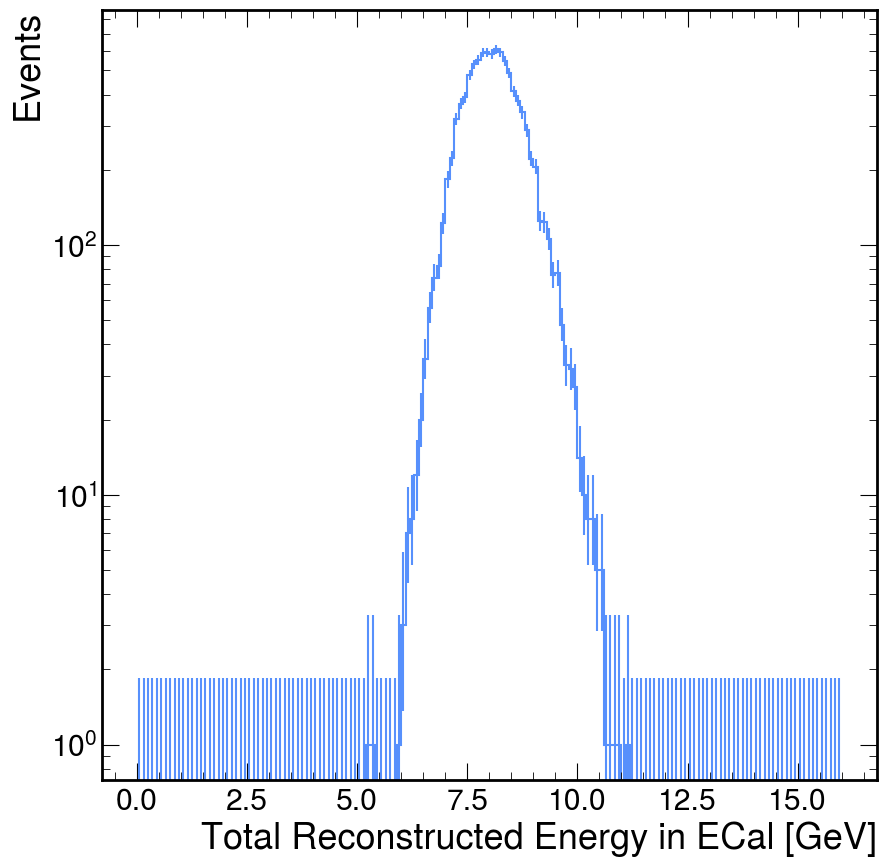
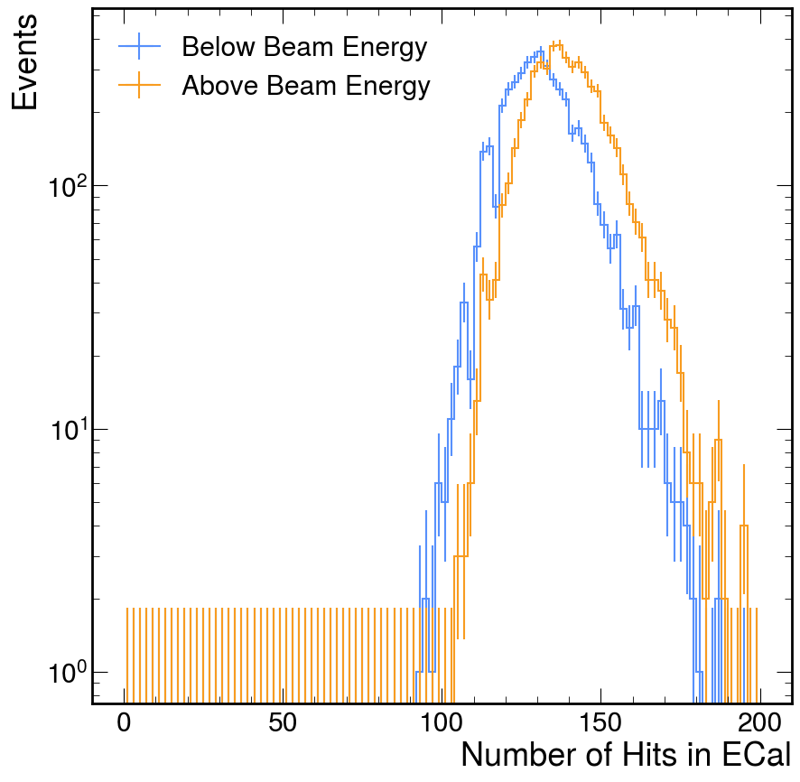

# Using Python (Efficiently)

Python is slow. I can't deny it. But Python, for better
or for worse, has taken over the scientific programming ecosystem
meaning there are a large set of packages that are open source,
professionally maintained, and perform the common tasks that
scientists want to do.

One aspect of Python that has enabled its widespread adoption
(I think) is the relative ease of writing packages in another
programming language. This means that most of our analysis
code will not be using "pure Python", but instead be using
compiled languages (C++ mostly) hidden behind some convenience
wrappers. This is the strategy of many popular Python packages
`numpy`, `scipy`, and the HEP-specific `hist` and `awkward`.

~~~admonish tip title="Biggest Performance Tip"
My biggest tip for any new Python analyzers is to avoid writing
the `for` loop. As mentioned, Python itself is slow, so only
write `for` if you know you are only looping over a small number
of things (e.g. looping over the five different plots you want
to make). We can avoid `for` by using these packages with compiled
languages under-the-hood. The syntax of writing these "vectorized"
operations is often complicated to grasp, but it is concise, precise,
and performant.
~~~

With those introductory ramblings out of the way, let's get started.

## Set Up
The packages we use (and the python ecosystem in general) evolves relatively fast.
For this reason, it will be helpful to use a newer python version such that you
can access the newer versions of the packages. Personally, I use
[denv](https://tomeichlersmith.github.io/denv/) to pick new python without needing 
to compile it and then have my installed
packages for that python be isolated to within my working directory.

While you can install the packages I'll be using directly, they (and a few other helpful
ones) are availabe withing the `scikit-hep` metapackage allowing a quick and simple
installation command. In addition, [Jupyter Lab](https://jupyter.org/) offers an excellent way to see
plots while your constructing them and recieve other feedback from your code in an
immediate way (via a [REPL](https://en.wikipedia.org/wiki/Read%E2%80%93eval%E2%80%93print_loop)
for those interested).
```
cd work-area
denv init python:3.11
denv pip install scikit-hep jupyterlab
```

In addition, you will need some data to play with. I generated the input `events.root`
file using an ldmx-sw simulation, but I am using common event objects that exist in
most (if not all) event files, so this example should work with others.

~~~admonish note title="Generate Event File with ldmx-sw" collapsible=true
Again, I used `denv` to pin the ldmx-sw version and generate the data file.
```
denv init ldmx/pro:v3.3.6 eg-gen
cd eg-gen
denv fire config.py
mv events.root path/to/work-area/
```
where `config.py` is the following python configuration script.
```python
{{#include gen.py}}
```
~~~

Launch a jupyter lab with
```
denv jupyter lab
```
open the link in your browser and create a new notebook to get started.

Notebooks consist of "cells" which
can contain "markdown" (a way to write write formatted text), code that will be executed, and raw text.
The rest of these sections are the the result of exporting a jupyter notebook (a `*.ipynb` file)
into "markdown" and then including it in this documentation here.

---

<!--
Developer Note: While I was initially intrigued to look for an automatic conversion tool
between the jupyter notebook I was writing and this documentation page, I did not like
the current ecosystem. There are many python-centric tools that serve to build the documentation
within a testing environment. This is helpful so that the documentation is confirmed to be
runnable, but is not helpful here since it would require a long setup phase of generating the
input data file. I decided to just go with the more simple option of manually exporting and
copying the markdown and images in here because if this simple analysis doesn't work anymore
then we need to rewrite this page anyways.

In anycase, when you manually export a notebook as markdown, Jupyter Lab downloads a *.zip
which contains the markdown file and the rendered images in PNG format. I unzipped that
package into this directory and then appended the markdown file here.

    cd path/to/website/src/analysis/
    gunzip ~/Downloads/eg-ana.zip
    cat eg-ana.md >> python.md

For readability, I then wrapped the output of the events array in a <details></details>
so that it is only opt-in.
-->
```python
# load the python modules we will use
import uproot # for data loading
import awkward as ak # for data manipulation
import hist # for histogram filling (and some plotting)

import matplotlib as mpl # for plotting
import matplotlib.pyplot as plt # common shorthand
import mplhep # style of plots
%matplotlib inline
mpl.style.use(mplhep.style.ROOT) # set the plot style
```

## Load Data
The first step to any analysis is loading the data.
For this step in this analysis workflow, we are going to use the `uproot` package
to load the data into `awkward` arrays in memory.
Some helpful links to find more details on this
- [uproot](https://uproot.readthedocs.io/en/latest/index.html)
- [uproot.open](https://uproot.readthedocs.io/en/latest/uproot.reading.open.html)
- [arrays method](https://uproot.readthedocs.io/en/latest/uproot.behaviors.TBranch.HasBranches.html#arrays)


```python
%%time
# while the uproot file is open, conver the 'LDMX_Events' tree into in-memory arrays
with uproot.open('events.root') as f:
    events = f['LDMX_Events'].arrays()
# show the events array
events
```

    CPU times: user 3.63 s, sys: 220 ms, total: 3.85 s
    Wall time: 3.85 s


<details>
  <summary>Printout of `events` array</summary>

<pre>[{&#x27;SimParticles_test.first&#x27;: [1, 2, 3, ..., 48, 49], ...},
 {&#x27;SimParticles_test.first&#x27;: [1, 2, 3, ..., 61, 62], ...},
 {&#x27;SimParticles_test.first&#x27;: [1, 2, 3, ..., 11, 12], ...},
 {&#x27;SimParticles_test.first&#x27;: [1, 2, ..., 15, 1199], ...},
 {&#x27;SimParticles_test.first&#x27;: [1, 2, 3, ..., 8, 9], ...},
 {&#x27;SimParticles_test.first&#x27;: [1, 2, ..., 118, 119], ...},
 {&#x27;SimParticles_test.first&#x27;: [1, 2, 3, ..., 10, 11], ...},
 {&#x27;SimParticles_test.first&#x27;: [1, 2, 3, ..., 10, 11], ...},
 {&#x27;SimParticles_test.first&#x27;: [1, 2, 3, ..., 7, 61], ...},
 {&#x27;SimParticles_test.first&#x27;: [1, 2, 3, ..., 10, 11], ...},
 ...,
 {&#x27;SimParticles_test.first&#x27;: [1, 2, 3, ..., 9, 10], ...},
 {&#x27;SimParticles_test.first&#x27;: [1, 2, ..., 126, 127], ...},
 {&#x27;SimParticles_test.first&#x27;: [1, 2, 3, ..., 9, 10], ...},
 {&#x27;SimParticles_test.first&#x27;: [1, 2, ..., 85, 4702], ...},
 {&#x27;SimParticles_test.first&#x27;: [1, 2, ..., 72, 6976], ...},
 {&#x27;SimParticles_test.first&#x27;: [1, 2, 3, ..., 8, 93], ...},
 {&#x27;SimParticles_test.first&#x27;: [1, 2, ..., 7120], ...},
 {&#x27;SimParticles_test.first&#x27;: [1, 2, ..., 7921], ...},
 {&#x27;SimParticles_test.first&#x27;: [1, 2, 3, ..., 8, 9], ...}]
---------------------------------------------------------------------
type: 10000 * {
    &quot;SimParticles_test.first&quot;: var * int32,
    &quot;SimParticles_test.second.energy_&quot;: var * float64,
    &quot;SimParticles_test.second.pdgID_&quot;: var * int32,
    &quot;SimParticles_test.second.genStatus_&quot;: var * int32,
    &quot;SimParticles_test.second.time_&quot;: var * float64,
    &quot;SimParticles_test.second.x_&quot;: var * float64,
    &quot;SimParticles_test.second.y_&quot;: var * float64,
    &quot;SimParticles_test.second.z_&quot;: var * float64,
    &quot;SimParticles_test.second.endX_&quot;: var * float64,
    &quot;SimParticles_test.second.endY_&quot;: var * float64,
    &quot;SimParticles_test.second.endZ_&quot;: var * float64,
    &quot;SimParticles_test.second.px_&quot;: var * float64,
    &quot;SimParticles_test.second.py_&quot;: var * float64,
    &quot;SimParticles_test.second.pz_&quot;: var * float64,
    &quot;SimParticles_test.second.endpx_&quot;: var * float64,
    &quot;SimParticles_test.second.endpy_&quot;: var * float64,
    &quot;SimParticles_test.second.endpz_&quot;: var * float64,
    &quot;SimParticles_test.second.mass_&quot;: var * float64,
    &quot;SimParticles_test.second.charge_&quot;: var * float64,
    &quot;SimParticles_test.second.daughters_&quot;: var * var * int32,
    &quot;SimParticles_test.second.parents_&quot;: var * var * int32,
    &quot;SimParticles_test.second.processType_&quot;: var * int32,
    &quot;SimParticles_test.second.vertexVolume_&quot;: var * string,
    &quot;TaggerSimHits_test.id_&quot;: var * int32,
    &quot;TaggerSimHits_test.layerID_&quot;: var * int32,
    &quot;TaggerSimHits_test.moduleID_&quot;: var * int32,
    &quot;TaggerSimHits_test.edep_&quot;: var * float32,
    &quot;TaggerSimHits_test.time_&quot;: var * float32,
    &quot;TaggerSimHits_test.px_&quot;: var * float32,
    &quot;TaggerSimHits_test.py_&quot;: var * float32,
    &quot;TaggerSimHits_test.pz_&quot;: var * float32,
    &quot;TaggerSimHits_test.energy_&quot;: var * float32,
    &quot;TaggerSimHits_test.x_&quot;: var * float32,
    &quot;TaggerSimHits_test.y_&quot;: var * float32,
    &quot;TaggerSimHits_test.z_&quot;: var * float32,
    &quot;TaggerSimHits_test.pathLength_&quot;: var * float32,
    &quot;TaggerSimHits_test.trackID_&quot;: var * int32,
    &quot;TaggerSimHits_test.pdgID_&quot;: var * int32,
    &quot;RecoilSimHits_test.id_&quot;: var * int32,
    &quot;RecoilSimHits_test.layerID_&quot;: var * int32,
    &quot;RecoilSimHits_test.moduleID_&quot;: var * int32,
    &quot;RecoilSimHits_test.edep_&quot;: var * float32,
    &quot;RecoilSimHits_test.time_&quot;: var * float32,
    &quot;RecoilSimHits_test.px_&quot;: var * float32,
    &quot;RecoilSimHits_test.py_&quot;: var * float32,
    &quot;RecoilSimHits_test.pz_&quot;: var * float32,
    &quot;RecoilSimHits_test.energy_&quot;: var * float32,
    &quot;RecoilSimHits_test.x_&quot;: var * float32,
    &quot;RecoilSimHits_test.y_&quot;: var * float32,
    &quot;RecoilSimHits_test.z_&quot;: var * float32,
    &quot;RecoilSimHits_test.pathLength_&quot;: var * float32,
    &quot;RecoilSimHits_test.trackID_&quot;: var * int32,
    &quot;RecoilSimHits_test.pdgID_&quot;: var * int32,
    &quot;HcalSimHits_test.id_&quot;: var * int32,
    &quot;HcalSimHits_test.edep_&quot;: var * float32,
    &quot;HcalSimHits_test.x_&quot;: var * float32,
    &quot;HcalSimHits_test.y_&quot;: var * float32,
    &quot;HcalSimHits_test.z_&quot;: var * float32,
    &quot;HcalSimHits_test.time_&quot;: var * float32,
    &quot;HcalSimHits_test.trackIDContribs_&quot;: var * var * int32,
    &quot;HcalSimHits_test.incidentIDContribs_&quot;: var * var * int32,
    &quot;HcalSimHits_test.pdgCodeContribs_&quot;: var * var * int32,
    &quot;HcalSimHits_test.edepContribs_&quot;: var * var * float32,
    &quot;HcalSimHits_test.timeContribs_&quot;: var * var * float32,
    &quot;HcalSimHits_test.nContribs_&quot;: var * uint32,
    &quot;HcalSimHits_test.pathLength_&quot;: var * float32,
    &quot;HcalSimHits_test.preStepX_&quot;: var * float32,
    &quot;HcalSimHits_test.preStepY_&quot;: var * float32,
    &quot;HcalSimHits_test.preStepZ_&quot;: var * float32,
    &quot;HcalSimHits_test.preStepTime_&quot;: var * float32,
    &quot;HcalSimHits_test.postStepX_&quot;: var * float32,
    &quot;HcalSimHits_test.postStepY_&quot;: var * float32,
    &quot;HcalSimHits_test.postStepZ_&quot;: var * float32,
    &quot;HcalSimHits_test.postStepTime_&quot;: var * float32,
    &quot;HcalSimHits_test.velocity_&quot;: var * float32,
    &quot;EcalSimHits_test.id_&quot;: var * int32,
    &quot;EcalSimHits_test.edep_&quot;: var * float32,
    &quot;EcalSimHits_test.x_&quot;: var * float32,
    &quot;EcalSimHits_test.y_&quot;: var * float32,
    &quot;EcalSimHits_test.z_&quot;: var * float32,
    &quot;EcalSimHits_test.time_&quot;: var * float32,
    &quot;EcalSimHits_test.trackIDContribs_&quot;: var * var * int32,
    &quot;EcalSimHits_test.incidentIDContribs_&quot;: var * var * int32,
    &quot;EcalSimHits_test.pdgCodeContribs_&quot;: var * var * int32,
    &quot;EcalSimHits_test.edepContribs_&quot;: var * var * float32,
    &quot;EcalSimHits_test.timeContribs_&quot;: var * var * float32,
    &quot;EcalSimHits_test.nContribs_&quot;: var * uint32,
    &quot;EcalSimHits_test.pathLength_&quot;: var * float32,
    &quot;EcalSimHits_test.preStepX_&quot;: var * float32,
    &quot;EcalSimHits_test.preStepY_&quot;: var * float32,
    &quot;EcalSimHits_test.preStepZ_&quot;: var * float32,
    &quot;EcalSimHits_test.preStepTime_&quot;: var * float32,
    &quot;EcalSimHits_test.postStepX_&quot;: var * float32,
    &quot;EcalSimHits_test.postStepY_&quot;: var * float32,
    &quot;EcalSimHits_test.postStepZ_&quot;: var * float32,
    &quot;EcalSimHits_test.postStepTime_&quot;: var * float32,
    &quot;EcalSimHits_test.velocity_&quot;: var * float32,
    &quot;TargetSimHits_test.id_&quot;: var * int32,
    &quot;TargetSimHits_test.edep_&quot;: var * float32,
    &quot;TargetSimHits_test.x_&quot;: var * float32,
    &quot;TargetSimHits_test.y_&quot;: var * float32,
    &quot;TargetSimHits_test.z_&quot;: var * float32,
    &quot;TargetSimHits_test.time_&quot;: var * float32,
    &quot;TargetSimHits_test.trackIDContribs_&quot;: var * var * int32,
    &quot;TargetSimHits_test.incidentIDContribs_&quot;: var * var * int32,
    &quot;TargetSimHits_test.pdgCodeContribs_&quot;: var * var * int32,
    &quot;TargetSimHits_test.edepContribs_&quot;: var * var * float32,
    &quot;TargetSimHits_test.timeContribs_&quot;: var * var * float32,
    &quot;TargetSimHits_test.nContribs_&quot;: var * uint32,
    &quot;TargetSimHits_test.pathLength_&quot;: var * float32,
    &quot;TargetSimHits_test.preStepX_&quot;: var * float32,
    &quot;TargetSimHits_test.preStepY_&quot;: var * float32,
    &quot;TargetSimHits_test.preStepZ_&quot;: var * float32,
    &quot;TargetSimHits_test.preStepTime_&quot;: var * float32,
    &quot;TargetSimHits_test.postStepX_&quot;: var * float32,
    &quot;TargetSimHits_test.postStepY_&quot;: var * float32,
    &quot;TargetSimHits_test.postStepZ_&quot;: var * float32,
    &quot;TargetSimHits_test.postStepTime_&quot;: var * float32,
    &quot;TargetSimHits_test.velocity_&quot;: var * float32,
    &quot;TriggerPad1SimHits_test.id_&quot;: var * int32,
    &quot;TriggerPad1SimHits_test.edep_&quot;: var * float32,
    &quot;TriggerPad1SimHits_test.x_&quot;: var * float32,
    &quot;TriggerPad1SimHits_test.y_&quot;: var * float32,
    &quot;TriggerPad1SimHits_test.z_&quot;: var * float32,
    &quot;TriggerPad1SimHits_test.time_&quot;: var * float32,
    &quot;TriggerPad1SimHits_test.trackIDContribs_&quot;: var * var * int32,
    &quot;TriggerPad1SimHits_test.incidentIDContribs_&quot;: var * var * int32,
    &quot;TriggerPad1SimHits_test.pdgCodeContribs_&quot;: var * var * int32,
    &quot;TriggerPad1SimHits_test.edepContribs_&quot;: var * var * float32,
    &quot;TriggerPad1SimHits_test.timeContribs_&quot;: var * var * float32,
    &quot;TriggerPad1SimHits_test.nContribs_&quot;: var * uint32,
    &quot;TriggerPad1SimHits_test.pathLength_&quot;: var * float32,
    &quot;TriggerPad1SimHits_test.preStepX_&quot;: var * float32,
    &quot;TriggerPad1SimHits_test.preStepY_&quot;: var * float32,
    &quot;TriggerPad1SimHits_test.preStepZ_&quot;: var * float32,
    &quot;TriggerPad1SimHits_test.preStepTime_&quot;: var * float32,
    &quot;TriggerPad1SimHits_test.postStepX_&quot;: var * float32,
    &quot;TriggerPad1SimHits_test.postStepY_&quot;: var * float32,
    &quot;TriggerPad1SimHits_test.postStepZ_&quot;: var * float32,
    &quot;TriggerPad1SimHits_test.postStepTime_&quot;: var * float32,
    &quot;TriggerPad1SimHits_test.velocity_&quot;: var * float32,
    &quot;TriggerPad2SimHits_test.id_&quot;: var * int32,
    &quot;TriggerPad2SimHits_test.edep_&quot;: var * float32,
    &quot;TriggerPad2SimHits_test.x_&quot;: var * float32,
    &quot;TriggerPad2SimHits_test.y_&quot;: var * float32,
    &quot;TriggerPad2SimHits_test.z_&quot;: var * float32,
    &quot;TriggerPad2SimHits_test.time_&quot;: var * float32,
    &quot;TriggerPad2SimHits_test.trackIDContribs_&quot;: var * var * int32,
    &quot;TriggerPad2SimHits_test.incidentIDContribs_&quot;: var * var * int32,
    &quot;TriggerPad2SimHits_test.pdgCodeContribs_&quot;: var * var * int32,
    &quot;TriggerPad2SimHits_test.edepContribs_&quot;: var * var * float32,
    &quot;TriggerPad2SimHits_test.timeContribs_&quot;: var * var * float32,
    &quot;TriggerPad2SimHits_test.nContribs_&quot;: var * uint32,
    &quot;TriggerPad2SimHits_test.pathLength_&quot;: var * float32,
    &quot;TriggerPad2SimHits_test.preStepX_&quot;: var * float32,
    &quot;TriggerPad2SimHits_test.preStepY_&quot;: var * float32,
    &quot;TriggerPad2SimHits_test.preStepZ_&quot;: var * float32,
    &quot;TriggerPad2SimHits_test.preStepTime_&quot;: var * float32,
    &quot;TriggerPad2SimHits_test.postStepX_&quot;: var * float32,
    &quot;TriggerPad2SimHits_test.postStepY_&quot;: var * float32,
    &quot;TriggerPad2SimHits_test.postStepZ_&quot;: var * float32,
    &quot;TriggerPad2SimHits_test.postStepTime_&quot;: var * float32,
    &quot;TriggerPad2SimHits_test.velocity_&quot;: var * float32,
    &quot;TriggerPad3SimHits_test.id_&quot;: var * int32,
    &quot;TriggerPad3SimHits_test.edep_&quot;: var * float32,
    &quot;TriggerPad3SimHits_test.x_&quot;: var * float32,
    &quot;TriggerPad3SimHits_test.y_&quot;: var * float32,
    &quot;TriggerPad3SimHits_test.z_&quot;: var * float32,
    &quot;TriggerPad3SimHits_test.time_&quot;: var * float32,
    &quot;TriggerPad3SimHits_test.trackIDContribs_&quot;: var * var * int32,
    &quot;TriggerPad3SimHits_test.incidentIDContribs_&quot;: var * var * int32,
    &quot;TriggerPad3SimHits_test.pdgCodeContribs_&quot;: var * var * int32,
    &quot;TriggerPad3SimHits_test.edepContribs_&quot;: var * var * float32,
    &quot;TriggerPad3SimHits_test.timeContribs_&quot;: var * var * float32,
    &quot;TriggerPad3SimHits_test.nContribs_&quot;: var * uint32,
    &quot;TriggerPad3SimHits_test.pathLength_&quot;: var * float32,
    &quot;TriggerPad3SimHits_test.preStepX_&quot;: var * float32,
    &quot;TriggerPad3SimHits_test.preStepY_&quot;: var * float32,
    &quot;TriggerPad3SimHits_test.preStepZ_&quot;: var * float32,
    &quot;TriggerPad3SimHits_test.preStepTime_&quot;: var * float32,
    &quot;TriggerPad3SimHits_test.postStepX_&quot;: var * float32,
    &quot;TriggerPad3SimHits_test.postStepY_&quot;: var * float32,
    &quot;TriggerPad3SimHits_test.postStepZ_&quot;: var * float32,
    &quot;TriggerPad3SimHits_test.postStepTime_&quot;: var * float32,
    &quot;TriggerPad3SimHits_test.velocity_&quot;: var * float32,
    &quot;EcalScoringPlaneHits_test.id_&quot;: var * int32,
    &quot;EcalScoringPlaneHits_test.layerID_&quot;: var * int32,
    &quot;EcalScoringPlaneHits_test.moduleID_&quot;: var * int32,
    &quot;EcalScoringPlaneHits_test.edep_&quot;: var * float32,
    &quot;EcalScoringPlaneHits_test.time_&quot;: var * float32,
    &quot;EcalScoringPlaneHits_test.px_&quot;: var * float32,
    &quot;EcalScoringPlaneHits_test.py_&quot;: var * float32,
    &quot;EcalScoringPlaneHits_test.pz_&quot;: var * float32,
    &quot;EcalScoringPlaneHits_test.energy_&quot;: var * float32,
    &quot;EcalScoringPlaneHits_test.x_&quot;: var * float32,
    &quot;EcalScoringPlaneHits_test.y_&quot;: var * float32,
    &quot;EcalScoringPlaneHits_test.z_&quot;: var * float32,
    &quot;EcalScoringPlaneHits_test.pathLength_&quot;: var * float32,
    &quot;EcalScoringPlaneHits_test.trackID_&quot;: var * int32,
    &quot;EcalScoringPlaneHits_test.pdgID_&quot;: var * int32,
    &quot;HcalScoringPlaneHits_test.id_&quot;: var * int32,
    &quot;HcalScoringPlaneHits_test.layerID_&quot;: var * int32,
    &quot;HcalScoringPlaneHits_test.moduleID_&quot;: var * int32,
    &quot;HcalScoringPlaneHits_test.edep_&quot;: var * float32,
    &quot;HcalScoringPlaneHits_test.time_&quot;: var * float32,
    &quot;HcalScoringPlaneHits_test.px_&quot;: var * float32,
    &quot;HcalScoringPlaneHits_test.py_&quot;: var * float32,
    &quot;HcalScoringPlaneHits_test.pz_&quot;: var * float32,
    &quot;HcalScoringPlaneHits_test.energy_&quot;: var * float32,
    &quot;HcalScoringPlaneHits_test.x_&quot;: var * float32,
    &quot;HcalScoringPlaneHits_test.y_&quot;: var * float32,
    &quot;HcalScoringPlaneHits_test.z_&quot;: var * float32,
    &quot;HcalScoringPlaneHits_test.pathLength_&quot;: var * float32,
    &quot;HcalScoringPlaneHits_test.trackID_&quot;: var * int32,
    &quot;HcalScoringPlaneHits_test.pdgID_&quot;: var * int32,
    &quot;TargetScoringPlaneHits_test.id_&quot;: var * int32,
    &quot;TargetScoringPlaneHits_test.layerID_&quot;: var * int32,
    &quot;TargetScoringPlaneHits_test.moduleID_&quot;: var * int32,
    &quot;TargetScoringPlaneHits_test.edep_&quot;: var * float32,
    &quot;TargetScoringPlaneHits_test.time_&quot;: var * float32,
    &quot;TargetScoringPlaneHits_test.px_&quot;: var * float32,
    &quot;TargetScoringPlaneHits_test.py_&quot;: var * float32,
    &quot;TargetScoringPlaneHits_test.pz_&quot;: var * float32,
    &quot;TargetScoringPlaneHits_test.energy_&quot;: var * float32,
    &quot;TargetScoringPlaneHits_test.x_&quot;: var * float32,
    &quot;TargetScoringPlaneHits_test.y_&quot;: var * float32,
    &quot;TargetScoringPlaneHits_test.z_&quot;: var * float32,
    &quot;TargetScoringPlaneHits_test.pathLength_&quot;: var * float32,
    &quot;TargetScoringPlaneHits_test.trackID_&quot;: var * int32,
    &quot;TargetScoringPlaneHits_test.pdgID_&quot;: var * int32,
    &quot;TrigScintScoringPlaneHits_test.id_&quot;: var * int32,
    &quot;TrigScintScoringPlaneHits_test.layerID_&quot;: var * int32,
    &quot;TrigScintScoringPlaneHits_test.moduleID_&quot;: var * int32,
    &quot;TrigScintScoringPlaneHits_test.edep_&quot;: var * float32,
    &quot;TrigScintScoringPlaneHits_test.time_&quot;: var * float32,
    &quot;TrigScintScoringPlaneHits_test.px_&quot;: var * float32,
    &quot;TrigScintScoringPlaneHits_test.py_&quot;: var * float32,
    &quot;TrigScintScoringPlaneHits_test.pz_&quot;: var * float32,
    &quot;TrigScintScoringPlaneHits_test.energy_&quot;: var * float32,
    &quot;TrigScintScoringPlaneHits_test.x_&quot;: var * float32,
    &quot;TrigScintScoringPlaneHits_test.y_&quot;: var * float32,
    &quot;TrigScintScoringPlaneHits_test.z_&quot;: var * float32,
    &quot;TrigScintScoringPlaneHits_test.pathLength_&quot;: var * float32,
    &quot;TrigScintScoringPlaneHits_test.trackID_&quot;: var * int32,
    &quot;TrigScintScoringPlaneHits_test.pdgID_&quot;: var * int32,
    &quot;TrackerScoringPlaneHits_test.id_&quot;: var * int32,
    &quot;TrackerScoringPlaneHits_test.layerID_&quot;: var * int32,
    &quot;TrackerScoringPlaneHits_test.moduleID_&quot;: var * int32,
    &quot;TrackerScoringPlaneHits_test.edep_&quot;: var * float32,
    &quot;TrackerScoringPlaneHits_test.time_&quot;: var * float32,
    &quot;TrackerScoringPlaneHits_test.px_&quot;: var * float32,
    &quot;TrackerScoringPlaneHits_test.py_&quot;: var * float32,
    &quot;TrackerScoringPlaneHits_test.pz_&quot;: var * float32,
    &quot;TrackerScoringPlaneHits_test.energy_&quot;: var * float32,
    &quot;TrackerScoringPlaneHits_test.x_&quot;: var * float32,
    &quot;TrackerScoringPlaneHits_test.y_&quot;: var * float32,
    &quot;TrackerScoringPlaneHits_test.z_&quot;: var * float32,
    &quot;TrackerScoringPlaneHits_test.pathLength_&quot;: var * float32,
    &quot;TrackerScoringPlaneHits_test.trackID_&quot;: var * int32,
    &quot;TrackerScoringPlaneHits_test.pdgID_&quot;: var * int32,
    &quot;MagnetScoringPlaneHits_test.id_&quot;: var * int32,
    &quot;MagnetScoringPlaneHits_test.layerID_&quot;: var * int32,
    &quot;MagnetScoringPlaneHits_test.moduleID_&quot;: var * int32,
    &quot;MagnetScoringPlaneHits_test.edep_&quot;: var * float32,
    &quot;MagnetScoringPlaneHits_test.time_&quot;: var * float32,
    &quot;MagnetScoringPlaneHits_test.px_&quot;: var * float32,
    &quot;MagnetScoringPlaneHits_test.py_&quot;: var * float32,
    &quot;MagnetScoringPlaneHits_test.pz_&quot;: var * float32,
    &quot;MagnetScoringPlaneHits_test.energy_&quot;: var * float32,
    &quot;MagnetScoringPlaneHits_test.x_&quot;: var * float32,
    &quot;MagnetScoringPlaneHits_test.y_&quot;: var * float32,
    &quot;MagnetScoringPlaneHits_test.z_&quot;: var * float32,
    &quot;MagnetScoringPlaneHits_test.pathLength_&quot;: var * float32,
    &quot;MagnetScoringPlaneHits_test.trackID_&quot;: var * int32,
    &quot;MagnetScoringPlaneHits_test.pdgID_&quot;: var * int32,
    channelIDs_: var * uint32,
    samples_: var * uint32,
    numSamplesPerDigi_: uint32,
    sampleOfInterest_: uint32,
    version_: int32,
    &quot;EcalRecHits_test.id_&quot;: var * int32,
    &quot;EcalRecHits_test.amplitude_&quot;: var * float32,
    &quot;EcalRecHits_test.energy_&quot;: var * float32,
    &quot;EcalRecHits_test.time_&quot;: var * float32,
    &quot;EcalRecHits_test.xpos_&quot;: var * float32,
    &quot;EcalRecHits_test.ypos_&quot;: var * float32,
    &quot;EcalRecHits_test.zpos_&quot;: var * float32,
    &quot;EcalRecHits_test.isNoise_&quot;: var * bool,
    eventNumber_: int32,
    run_: int32,
    &quot;timestamp_.fSec&quot;: int32,
    &quot;timestamp_.fNanoSec&quot;: int32,
    weight_: float64,
    isRealData_: bool,
    &quot;intParameters_.first&quot;: var * string,
    &quot;intParameters_.second&quot;: var * int32,
    &quot;floatParameters_.first&quot;: var * string,
    &quot;floatParameters_.second&quot;: var * float32,
    &quot;stringParameters_.first&quot;: var * string,
    &quot;stringParameters_.second&quot;: var * string
}</pre>

</details>


Oh wow, that's a lot of branches! While this printout can be overwhelming, I'd encourage you
to look through it. Each branch is named and contains the number in each event 
(`var` is used if the number varies) and the type of object (`string`, `float32`, `bool` to name
a few). This printout is very helpful for familiarizing yourself with an `awkward` array and its structure
so don't be shy to look at it and scroll through it!

## Manipulate Data
This is probably the most complicated part not least because I'm not sure what analysis you actually want to do.
As an example, and to show the power of "vectorization", I am going to calculate the total energy reconstructed within the ECal.
These lines are often short but incredibly dense. Do not be afraid to try a few out and see the results, changing the input `axis`,
as well as other branches of `events`. While it can be difficult to find the right expression to do the manipulation you wish,
trying different expressions is an incredibly quick procedure and one that I would enourage you to do. Instead of assigning
the result to a variable, you can even just print it directly to the console like `events` above so you can see the resulting
shape and a few example values.

[awkward's website](https://awkward-array.org/doc/main/index.html) is growing with documentation and has a detailed reference of the available commands.
Nevertheless, you can find more help on [numpy's website](https://numpy.org/doc/stable/) whose syntax and vocabulary is a main inspiration for `awkward`.
Specifically, I would guide folks to [What is NumPy](https://numpy.org/doc/stable/user/whatisnumpy.html#whatisnumpy) and the
[NumPy Beginners Guide](https://numpy.org/doc/stable/user/absolute_beginners.html) to be given helpful definitions of the relevant vocabulary
("vectorization", "array", "axis", "attribute" to name a few).


```python
%%time
# add up the energy_ along axis 1, axis 0 is the "outermost" axis which is indexed by event
total_ecal_rec_energy = ak.sum(events['EcalRecHits_test.energy_'], axis=1)
```

    CPU times: user 5.99 ms, sys: 2 ms, total: 7.99 ms
    Wall time: 7.34 ms


## Fill Histogram
Filling a histogram is where we condense a variable calculated for many events into an object that can be viewed and interpreted.
While `numpy` and `matplotlib` have histogram [filling](https://numpy.org/doc/stable/reference/generated/numpy.histogram.html)
and [plotting](https://matplotlib.org/stable/api/_as_gen/matplotlib.pyplot.hist.html) that work well. The `hist` package gives
a more flexible definition of histogram, allowing you to define histograms with more axes, do calculations with histograms
(e.g. sum over bins, rebin, slicing, projection), and eventually plot them.
We won't go into multi-dimensional (more than one axis) histograms or histogram calcuations here,
but the links below give a helpful overview of available options.

- [hist](https://hist.readthedocs.io/en/latest/)
- [hist indexing](https://uhi.readthedocs.io/en/latest/indexing.html) (the stuff you can put between square brackets)


```python
%%time
# construct the histogram defining a Regular (Reg) binning
# I found this binning after trying a few options
tere_h = hist.Hist.new.Reg(160,0,16,label='Total Reconstructed Energy in ECal [GeV]').Double()
# fill the histogram with the passed array
# I'm dividing by 1000 here to convert the MeV to GeV
tere_h.fill(total_ecal_rec_energy/1000.)
```

    CPU times: user 1.18 ms, sys: 44 µs, total: 1.23 ms
    Wall time: 1.26 ms


<html>
<div style="display:flex; align-items:center;">
<div style="width:290px;">
<svg xmlns="http://www.w3.org/2000/svg" viewBox="-10 -105 270 120">
<line x1="-5" y1="0" x2="255" y2="0" style="fill:none;stroke-width:2;stroke:currentColor"/>
<text text-anchor="middle" x="0" y="15" style="fill:currentColor;">
0
</text>
<text text-anchor="middle" x="250" y="15" style="fill:currentColor;">
16
</text>
<text text-anchor="middle" x="125.0" y="15" style="fill:currentColor;">
Total Reconstructed Energy in ECal [GeV]
</text>
<polyline points="  0,0   0,-0 1.5625,-0 1.5625,-0 3.125,-0 3.125,-0 4.6875,-0 4.6875,-0 6.25,-0 6.25,-0 7.8125,-0 7.8125,-0 9.375,-0 9.375,-0 10.9375,-0 10.9375,-0 12.5,-0 12.5,-0 14.0625,-0 14.0625,-0 15.625,-0 15.625,-0 17.1875,-0 17.1875,-0 18.75,-0 18.75,-0 20.3125,-0 20.3125,-0 21.875,-0 21.875,-0 23.4375,-0 23.4375,-0  25,-0  25,-0 26.5625,-0 26.5625,-0 28.125,-0 28.125,-0 29.6875,-0 29.6875,-0 31.25,-0 31.25,-0 32.8125,-0 32.8125,-0 34.375,-0 34.375,-0 35.9375,-0 35.9375,-0 37.5,-0 37.5,-0 39.0625,-0 39.0625,-0 40.625,-0 40.625,-0 42.1875,-0 42.1875,-0 43.75,-0 43.75,-0 45.3125,-0 45.3125,-0 46.875,-0 46.875,-0 48.4375,-0 48.4375,-0  50,-0  50,-0 51.5625,-0 51.5625,-0 53.125,-0 53.125,-0 54.6875,-0 54.6875,-0 56.25,-0 56.25,-0 57.8125,-0 57.8125,-0 59.375,-0 59.375,-0 60.9375,-0 60.9375,-0 62.5,-0 62.5,-0 64.0625,-0 64.0625,-0 65.625,-0 65.625,-0 67.1875,-0 67.1875,-0 68.75,-0 68.75,-0 70.3125,-0 70.3125,-0 71.875,-0 71.875,-0 73.4375,-0 73.4375,-0  75,-0  75,-0 76.5625,-0 76.5625,-0 78.125,-0 78.125,-0 79.6875,-0 79.6875,-0 81.25,-0 81.25,-0.164 82.8125,-0.164 82.8125,-0.164 84.375,-0.164 84.375,-0 85.9375,-0 85.9375,-0 87.5,-0 87.5,-0 89.0625,-0 89.0625,-0 90.625,-0 90.625,-0 92.1875,-0 92.1875,-0.164 93.75,-0.164 93.75,-0.493 95.3125,-0.493 95.3125,-1.15 96.875,-1.15 96.875,-1.32 98.4375,-1.32 98.4375,-1.97 100,-1.97 100,-3.29 101.562,-3.29 101.562,-5.76 103.125,-5.76 103.125,-9.21 104.688,-9.21 104.688,-12.2 106.25,-12.2 106.25,-13.5 107.812,-13.5 107.812,-20.1 109.375,-20.1 109.375,-30.1 110.938,-30.1 110.938,-36.5 112.5,-36.5 112.5,-52.6 114.062,-52.6 114.062,-60.5 115.625,-60.5 115.625,-64.1 117.188,-64.1 117.188,-78.9 118.75,-78.9 118.75,-86.8 120.312,-86.8 120.312,-90.5 121.875,-90.5 121.875,-96.9 123.438,-96.9 123.438,-97.2 125,-97.2 125,-95.6 126.562,-95.6 126.562,-100 128.125,-100 128.125,-97.2 129.688,-97.2 129.688,-89.5 131.25,-89.5 131.25,-79.9 132.812,-79.9 132.812,-67.9 134.375,-67.9 134.375,-62.2 135.938,-62.2 135.938,-55.8 137.5,-55.8 137.5,-47.4 139.062,-47.4 139.062,-36.3 140.625,-36.3 140.625,-33.9 142.188,-33.9 142.188,-20.6 143.75,-20.6 143.75,-20.2 145.312,-20.2 145.312,-17.4 146.875,-17.4 146.875,-12.5 148.438,-12.5 148.438,-12.7 150,-12.7 150,-7.89 151.562,-7.89 151.562,-5.43 153.125,-5.43 153.125,-5.26 154.688,-5.26 154.688,-4.44 156.25,-4.44 156.25,-2.3 157.812,-2.3 157.812,-1.64 159.375,-1.64 159.375,-1.32 160.938,-1.32 160.938,-1.32 162.5,-1.32 162.5,-0.822 164.062,-0.822 164.062,-0.822 165.625,-0.822 165.625,-0.164 167.188,-0.164 167.188,-0.164 168.75,-0.164 168.75,-0.164 170.312,-0.164 170.312,-0.164 171.875,-0.164 171.875,-0 173.438,-0 173.438,-0.164 175,-0.164 175,-0 176.562,-0 176.562,-0 178.125,-0 178.125,-0 179.688,-0 179.688,-0 181.25,-0 181.25,-0 182.812,-0 182.812,-0 184.375,-0 184.375,-0 185.938,-0 185.938,-0 187.5,-0 187.5,-0 189.062,-0 189.062,-0 190.625,-0 190.625,-0 192.188,-0 192.188,-0 193.75,-0 193.75,-0 195.312,-0 195.312,-0 196.875,-0 196.875,-0 198.438,-0 198.438,-0 200,-0 200,-0 201.562,-0 201.562,-0 203.125,-0 203.125,-0 204.688,-0 204.688,-0 206.25,-0 206.25,-0 207.812,-0 207.812,-0 209.375,-0 209.375,-0 210.938,-0 210.938,-0 212.5,-0 212.5,-0 214.062,-0 214.062,-0 215.625,-0 215.625,-0 217.188,-0 217.188,-0 218.75,-0 218.75,-0 220.312,-0 220.312,-0 221.875,-0 221.875,-0 223.438,-0 223.438,-0 225,-0 225,-0 226.562,-0 226.562,-0 228.125,-0 228.125,-0 229.688,-0 229.688,-0 231.25,-0 231.25,-0 232.812,-0 232.812,-0 234.375,-0 234.375,-0 235.938,-0 235.938,-0 237.5,-0 237.5,-0 239.062,-0 239.062,-0 240.625,-0 240.625,-0 242.188,-0 242.188,-0 243.75,-0 243.75,-0 245.312,-0 245.312,-0 246.875,-0 246.875,-0 248.438,-0 248.438,-0 250,-0 250,0" style="fill:none; stroke:currentColor;"/>
</svg>
</div>
<div style="flex=grow:1;">
Regular(160, 0, 16, label='Total Reconstructed Energy in ECal [GeV]')<br/>
<hr style="margin-top:.2em; margin-bottom:.2em;"/>
Double() Σ=10000.0

</div>
</div>
</html>


## Plot Histogram
The final step is converting our histogram into an image that is helpful for us humans! `hist` connects to the standard `matplotlib` through a styling package called `mplhep`. Both of which have documentation sites that are helpful to browse so you can gain an idea of the available functions.
- [matplotlib](https://matplotlib.org/) is used extensively inside and outside HEP, I often find an immediate answer with a simple internet search (e.g. searching `plt change aspect ratio` tells you how to change the aspect ratio of your plot).
- [mplhep](https://mplhep.readthedocs.io/en/latest/) is a wrapper around matplotlib for HEP to do common things like plot histograms.


```python
tere_h.plot()
plt.yscale('log')
plt.ylabel('Events')
plt.show()
```


    

    


## Round-and-Round We Go
Now, in almost all of my analyses, one plot just immediately opens the door to new questions.
For example, I notice that this total energy plot is rather broad, I want to see why that is.
One idea is that it is simply a function of how many hits we observed in the ECal. There are many
ways to test this hypothesis, but I'm going to do a specific method that showcases a specific tool
that is extremely useful: [boolean slicing](https://awkward-array.org/doc/main/user-guide/how-to-examine-simple-slicing.html#boolean-array-slices)
(awkward's implementation is inspired by [numpy's boolean slicing](https://numpy.org/doc/stable/user/basics.indexing.html#boolean-array-indexing)
but it also interacts with the idea of [broadcasting](https://numpy.org/doc/stable/user/basics.broadcasting.html)
between arrays).

I also showcase a helpful feature of `hist` where if the first axis is a `StrCategory`, then
the resulting `plot` will just overlay the plots along the other axis.

You'll notice that, while I'm manipulating the data, filling a histogram, and plotting the histogram,
I **do not** need to re-load the data. This is by design. Jupyter Lab (and the notebooks it interacts
with) use an interactive Python "kernel" to hold variables in memory while you are using them. This
is helpful to avoid the time-heavy job of loading data into memory, but it can be an area of confusion.
Be careful to not re-use variable names and create new notebooks often!


```python
nhits_by_tere_h = (
    hist.Hist.new
    .StrCategory(['Below Beam Energy','Above Beam Energy'])
    .Reg(100,0,200,label='Number of Hits in ECal')
    .Double()
)
n_ecal_hits = ak.count(events['EcalRecHits_test.id_'], axis=1)
nhits_by_tere_h.fill(
    'Below Beam Energy',
    n_ecal_hits[total_ecal_rec_energy < 8000.]
)
nhits_by_tere_h.fill(
    'Above Beam Energy',
    n_ecal_hits[total_ecal_rec_energy > 8000.]
)
nhits_by_tere_h.plot()
plt.yscale('log')
plt.ylabel('Events')
plt.legend()
plt.show()
```


    

